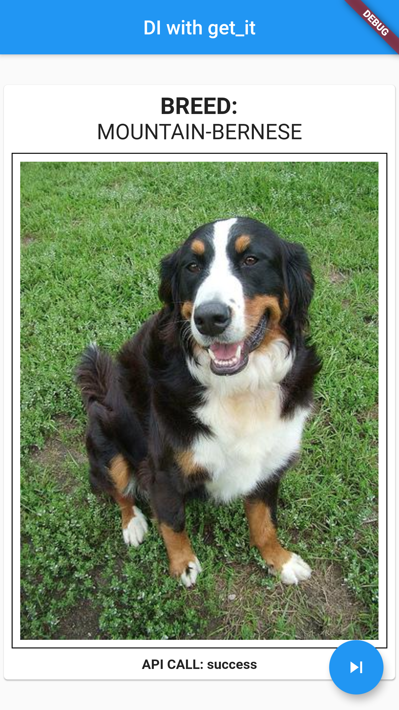

# get_it_example1

A simple example of using get_it lib

## ✨ Requirements
* Any Operating System (ie. MacOS X, Linux, Windows)
* Any IDE with Flutter SDK installed (ie. IntelliJ, Android Studio, VSCode etc)
* A little knowledge of Dart and Flutter
* A brain to think 🤓🤓

## 📖 Inspiration

[**https://www.youtube.com/watch?v=DbV5RV2HRUk**](https://www.youtube.com/watch?v=DbV5RV2HRUk)

## 📸 ScreenShots
| No Random Dog Data Loaded  | Random Dog Data Loaded |
| ------------- | ------------- |
|  |  |

## 🤓 Author(s)
* [**Bukunmi Aluko**](https://github.com/bukunmialuko)
